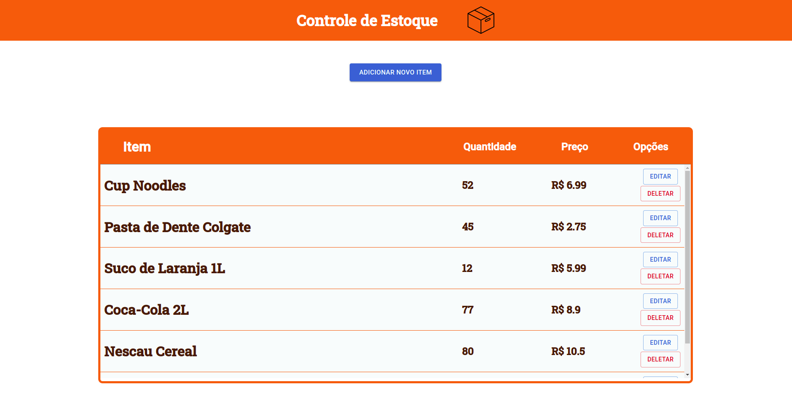

# Controle de Estoque

Projeto que realiza um controle de estoque de um estabelecimento, sendo possível criar, visualizar, editar e deletar os itens do estoque.

## Tecnologias
#### Backend
* Node.js
* Express
#### Banco de Dados
* MongoDB
#### Frontend
* React
* TypeScript
